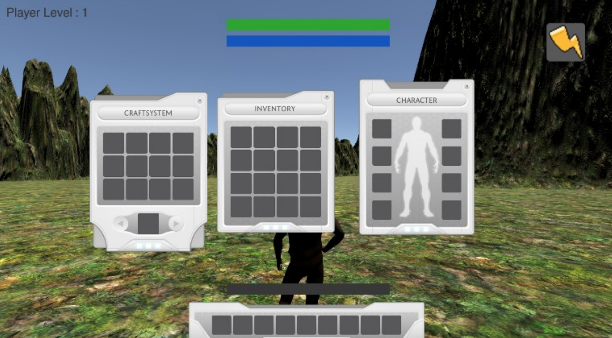
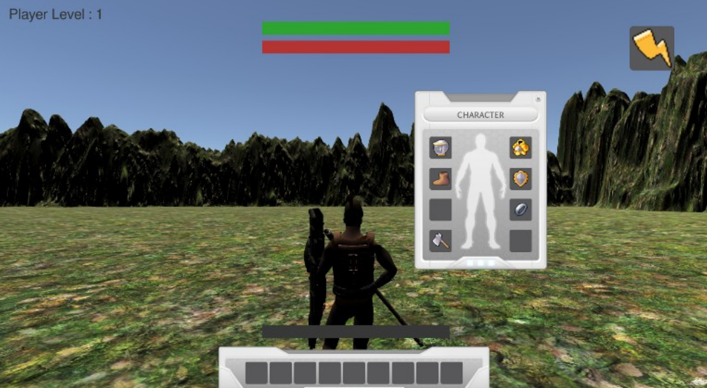
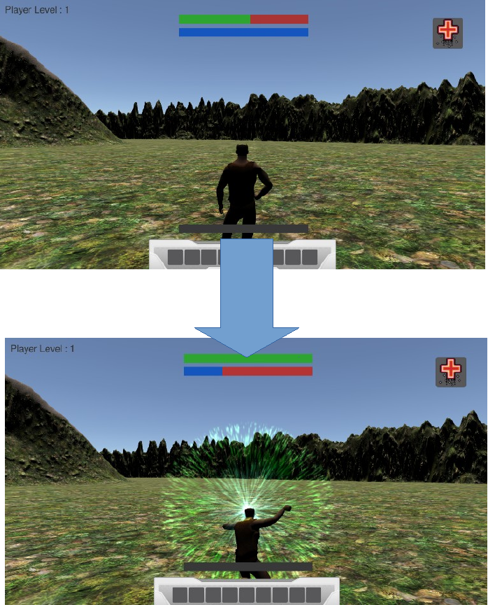

# RPGUnity
A Unity Project done in the final hours of my Licence. You need Unity to run this project
The project is a little RPG type of game, which have a looting system, a combat system, a experience system, a power system and an equipement system.
All of this, excepts the assets was made by me.

Due to the size of the project, some parts are missing that I could not import correctly. The project may therefore not run correctly.

Here is some exemples of the game :

Inventory interface :

Inventory interface with equipement equiped :

Utilisation of a life power :

